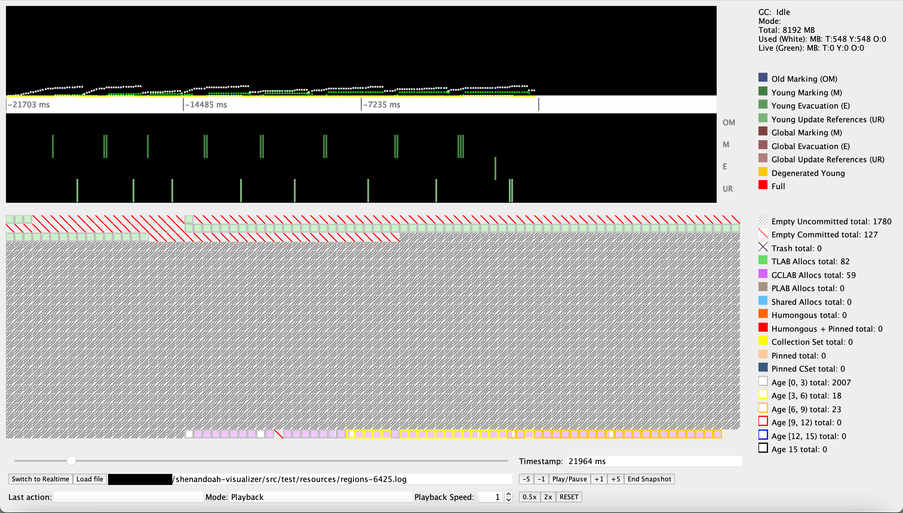
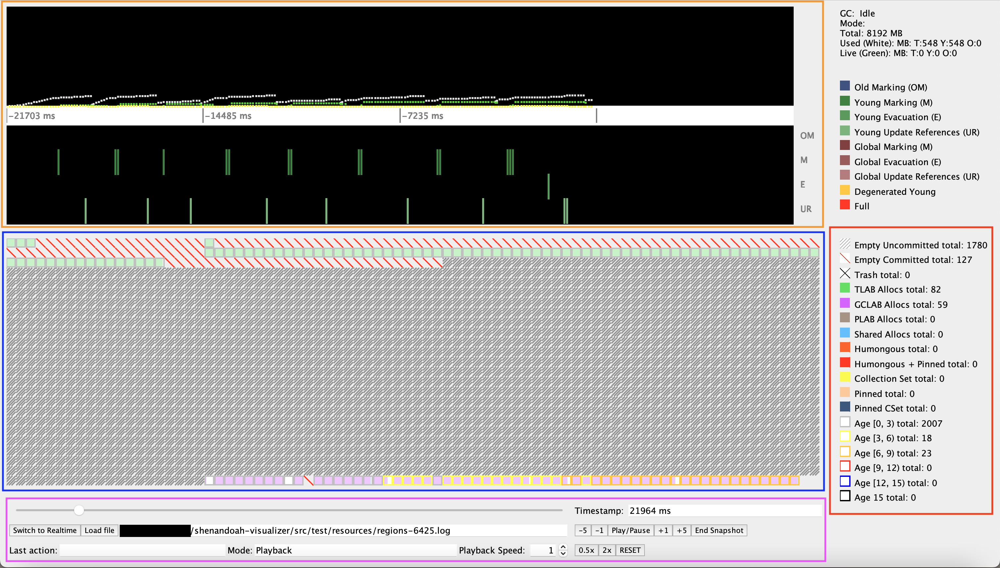
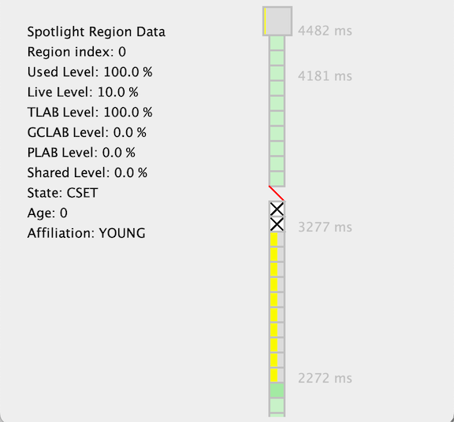

# Shenandoah Visualizer

Shenandoah Visualizer is a low-level tool to visualize the internal state of
[Shenandoah GC](https://wiki.openjdk.java.net/display/Shenandoah). It relies on
jvmstat interface to pull the data from the live JVM.



## Building

Build as any Maven-driven Java project:

    $ mvn clean verify

...or pick up the binary build [from here](https://builds.shipilev.net/shenandoah-visualizer/).

## Usage


#### Realtime
*Step 1.* Start target JVM with these additional flags:

    $ java -XX:+UseShenandoahGC -XX:+UsePerfData -XX:+UnlockExperimentalVMOptions -XX:+ShenandoahRegionSampling ...

*Step 2.* Figure out the target JVM PID:

    $ jps

*Step 3a.* Run the Visualizer; Visualizer will attempt to detect a JVM running Shenandoah:
    
    $ java -jar visualizer.jar

*Step 3b.* Optionally attach the Visualizer using the -vm flag:
  If using JDK8:

    $ java -Xbootclasspath/p:<path-to-tools.jar> -jar visualizer.jar -vm local://<pid>
`tools.jar` can usually be found at `$JAVA_HOME/lib`

  If using JDK17+
```bash
  $ java --add-exports jdk.internal.jvmstat/sun.jvmstat.monitor=ALL-UNNAMED -jar visualizer.jar
```
  Note that if you are using Intellij, you can also add these exports to the compiler (settings->javac) so that you can build and debug within the IDE.


#### Saving JVM session
Add this additional flag to an active JVM running Shenandoah:

    $ -Xlog:gc+region=trace:<file name>::filesize=<Target byte size for log rotation>,filecount=<Number of files to keep in rotation>


#### Replaying JVM session
*Step 1.* Run the Visualizer using the -logFile flag:

    $ java -jar visualizer.jar -logFile <file path>

#### Visualizer User Interface
* **Graph (Orange box on the top)**: different displacements for different collector phases and a new timescale
* **Region (Blue box in the middle)**: generates popup window with detailed information of chosen region and historical timeline of the states for that region
* **Toolbar (Pink box in the bottom)**: buttons and slider to control the timeline and speed for the replay mode with keyboard shortcut 
  * `space bar`: play/pause
  * `up`: `+5` snapshots
  * `down`: `-5` snapshots
  * `left`: `-1` snapshot
  * `right`: `+1` snapshot
  * `enter`: reaches the last snapshot of the replay
* **Summary view (Red box on the right)**: provides the total number of regions in each state



Sample region popup window view



